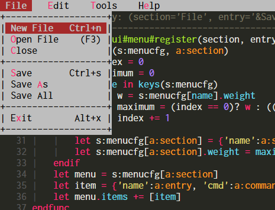
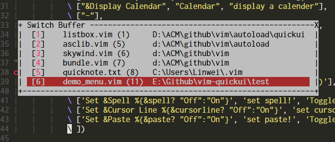
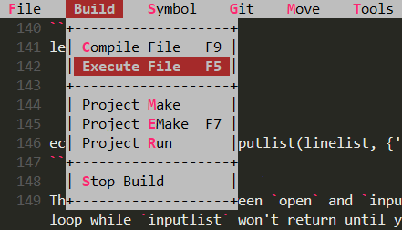
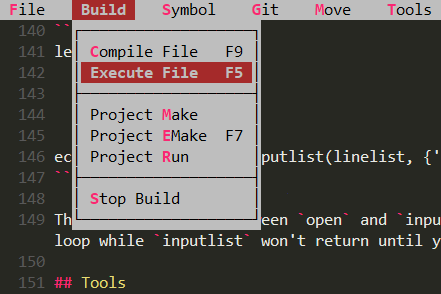
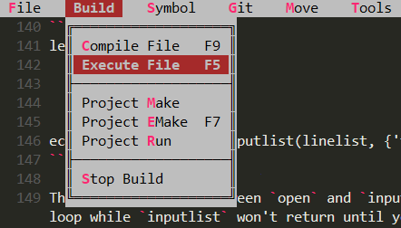
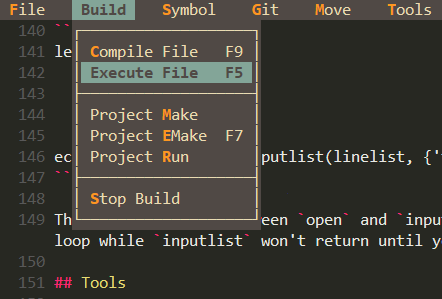
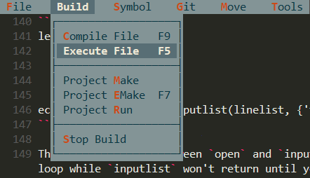
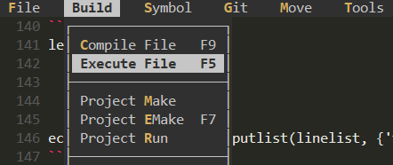
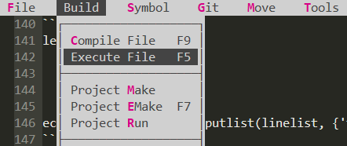

# What Is It ?

There are many keymaps defined in my `.vimrc`. Getting tired from checking `.vimrc` time to time when I forget some, based on latest `+popup` feature (vim 8.2), I created this `vim-quickui` plugin to introduce some basic ui components to enrich vim's interactive experience:

- Well designed and carefully colored Borland/Turbo C++ flavor ui system combined with vim's productivity.
- Can be accessed by keyboard only while mouse is also supported.
- Navigate with the usual Vim keys like `h/j/k/l`, confirm with `ENTER/SPACE` and cancel with `ESC/Ctrl+[`.
- `Tip` for each entry can display in the cmdline when you are moving the cursor around.
- Available widgets: [menu](#menu), [listbox](#listbox), .. (coming soon)
- Pure vim-script, `+python` is not required.
- No longer have to be afraid to forget keymaps anymore.

Just see this GIF demonstration below:


Trying to share my configuration to my friends, I found that they did't have patience to remember all the keymaps in my vimrc, but text ui is quite accaptable for them.

## Installation

    Plug 'skywind3000/vim-quickui'

## Available Widgets


### Menu

Display a dropdown menubar at top of the screen:



APIs:

register menu entries:

```VimL
call quickui#menu#install(section, items [, weight])
```

display the menu:

```VimL
call quickui#menu#open()
```

Sample code:

```VimL
" clear all the menus
call quickui#menu#reset()

" install a 'File' menu, use [text, command] to represent an item.
call quickui#menu#install('&File', [
            \ [ "&New File\tCtrl+n", 'echo 0' ],
            \ [ "&Open File\t(F3)", 'echo 1' ],
            \ [ "&Close", 'echo 2' ],
            \ [ "--", '' ],
            \ [ "&Save\tCtrl+s", 'echo 3'],
            \ [ "Save &As", 'echo 4' ],
            \ [ "Save All", 'echo 5' ],
            \ [ "--", '' ],
            \ [ "E&xit\tAlt+x", 'echo 6' ],
            \ ])

" items containing tips, tips will display in the cmdline
call quickui#menu#install('&Edit', [
            \ [ '&Copy', 'echo 1', 'help 1' ],
            \ [ '&Paste', 'echo 2', 'help 2' ],
            \ [ '&Find', 'echo 3', 'help 3' ],
            \ ])

" script inside %{...} will be evaluated and expanded in the string
call quickui#menu#install("&Option", [
			\ ['Set &Spell %{&spell? "Off":"On"}', 'set spell!'],
			\ ['Set &Cursor Line %{&cursorline? "Off":"On"}', 'set cursorline!'],
			\ ['Set &Paste %{&paste? "Off":"On"}', 'set paste!'],
			\ ])

" register HELP menu with weight 1000
call quickui#menu#install('H&elp', [
			\ ["&Cheatsheet", 'help index', ''],
			\ ['T&ips', 'help tips', ''],
			\ ['--',''],
			\ ["&Tutorial", 'help tutor', ''],
			\ ['&Quick Reference', 'help quickref', ''],
			\ ['&Summary', 'help summary', ''],
			\ ], 10000)

" enable to display tips in the cmdline
let g:quickui_show_tip = 1

" hit space twice to open menu
noremap <space><space> :call quickui#menu#open()<cr>
```

Then you can open the menu by pressing space twice.

### Listbox

Can display an array of string items in the popup window and can be used to pick up an item.



Features:

- Listbox can used to pick up item from thousands items.
- Columns separated by `"\t"` will be aligned.
- A scroll bar will display if there are too many items.
- Mouse wheel can be used to scroll the content.
- Character starting with `&` can be used as a shortcut.
- It has a title, and can be dragged by mouse.

APIs:

Open the listbox:

```VimL
quickui#listbox#open(content, opts)
```

Parameter `content` is a list of `[text, command]` items. `opts` is a dictionary.

Sample code:

```VimL
let content = [
            \ [ 'echo 1', 'echo 100' ],
            \ [ 'echo 2', 'echo 200' ],
            \ [ 'echo 3', 'echo 300' ],
            \ [ 'echo 4' ],
            \ [ 'echo 5', 'echo 500' ],
            \]
let opts = {'title': 'select one'}
call quickui#listbox#open(content, opts)
```

It can also work like `inputlist()` function by using `quickui#listbox#inputlist`, it will return the index you select immediatedly instead of executing a vim command:

```VimL
let linelist = [
            \ "line 1",
            \ "line 2",
            \ "line 3" 
            \ ]
echo quickui#listbox#inputlist(linelist, {'title':'select'})
```

The key difference between `open` and `inputlist` is `open` will return immediately to vim's event loop while `inputlist` won't return until you select an item or press `ESC`.

## Tools

Tools are build upon basic widgets.

### Buffer switcher

There is a builtin buffer switcher using `listbox`, open it by:

    call quickui#tools#list_buffer('e')

or 
   
    call quickui#tools#list_buffer('tabedit')

Then `hjkl` to navigate, `enter`/`space` to switch buffer and `ESC`/`CTRL+[` to quit.

## Customize

### How to change border style ?

Change border characters.


    let g:quickui_border_style = 1   (default)




    let g:quickui_border_style = 2



    let g:quickui_border_style = 3



### How to change color scheme ?

There are 4 builtini color themes below:

    let g:quickui_color_theme = 'borland'

Set to `"borland"` will use the default color theme.

    let g:quickui_color_theme = 'gruvbox'



    let g:quickui_color_theme = 'solarized'



    let g:quickui_color_theme = 'papercol'  
    set background=dark



    let g:quickui_color_theme = 'papercol'  
    set background=light



### Specify color group precisely

If none of the builtin color schemes satisfy your need, you can define the color groups your self in your `.vimrc` before enter vim (`VimEnter` event).

| Group | Meaning |
|-|-|
| QuickBG | Background color |
| QuickSel | Selector (or cursor) color |
| QuickKey | Hotkey (or shortcut-key) color |
| QuickOff | Disabled item color |
| QuickHelp | Tip text color |

Default color `"borland"` is defined as:

```VimL
hi! QuickBG ctermfg=0 ctermbg=7 guifg=black guibg=gray
hi! QuickSel cterm=bold ctermfg=0 ctermbg=2 gui=bold guibg=brown guifg=gray
hi! QuickKey term=bold ctermfg=9 gui=bold guifg=#f92772
hi! QuickOff ctermfg=59 guifg=#75715e
hi! QuickHelp ctermfg=247 guifg=#959173
```


## Self-promotion

like vim-quickui? Follow the repository on [GitHub](https://github.com/skywind3000/vim-quickui) and vote for it on [vim.org](https://www.vim.org/scripts/script.php?script_id=5845). And if you're feeling especially charitable, follow skywind3000 on [Twitter](https://twitter.com/skywind3000) and [GitHub](https://github.com/skywind3000).

## Credit

This plugin will not be possible without Bram's effort on `+popup` feature.

