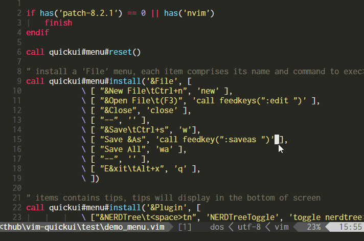
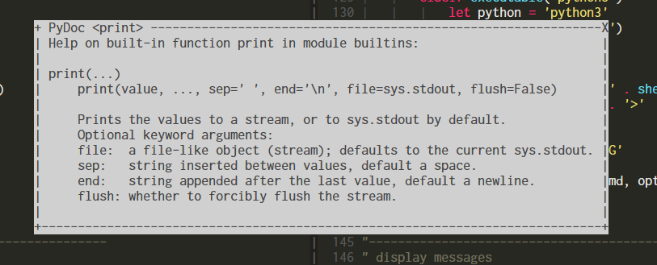
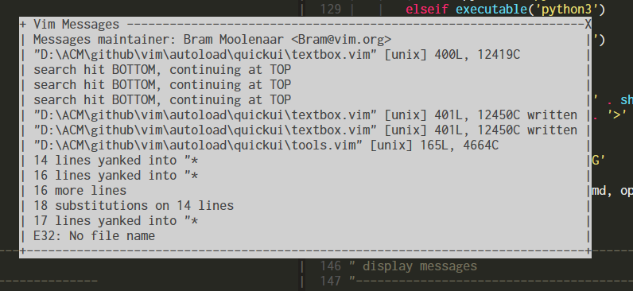
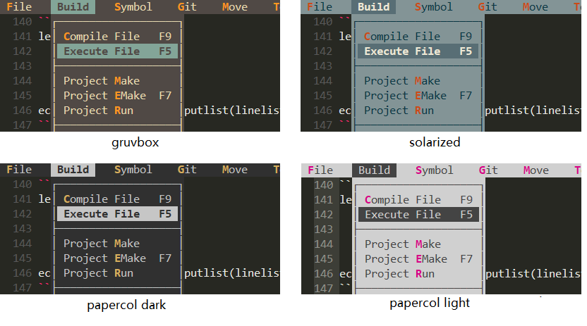
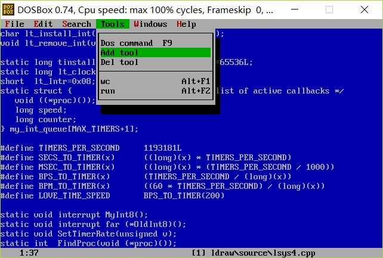

# What Is It ?

There are many keymaps defined in my `.vimrc`. Getting tired from checking `.vimrc` time to time when I forget some, based on latest `+popup` feature (vim 8.2), I created this `vim-quickui` plugin to introduce some basic ui components to enrich vim's interactive experience:

- Well designed and carefully colored Borland/Turbo C++ flavor ui system combined with vim's productivity.
- Can be accessed by keyboard only while mouse is also supported.
- Navigate with the usual Vim keys like `h/j/k/l`, confirm with `ENTER/SPACE` and cancel with `ESC/Ctrl+[`.
- `Tip` for each entry can display in the cmdline when you are moving the cursor around.
- Available widgets: [menu](#menu), [listbox](#listbox), [textbox](#textbox).. (coming soon)
- Fully customizable, including color scheme and borders.
- Corresponding experience in both `Vim` and `NeoVim`.
- Pure vim-script, `+python` is not required.
- No longer have to be afraid to forget keymaps anymore.

Just see this GIF demonstration below:



Trying to share my configuration to my friends, I found that they did't have patience to remember all the keymaps in my vimrc, but text ui is quite accaptable for them.

# Content 

<!-- TOC -->

- [Requirements](#requirements)
- [Installation](#installation)
- [Available Widgets](#available-widgets)
    - [Menu](#menu)
    - [Listbox](#listbox)
    - [Textbox](#textbox)
- [Tools](#tools)
    - [Buffer switcher](#buffer-switcher)
- [Customize](#customize)
    - [How to change border style](#how-to-change-border-style)
    - [How to change the color scheme](#how-to-change-the-color-scheme)
    - [Specify color group precisely](#specify-color-group-precisely)
- [Who Am I ?](#who-am-i-)
- [Credit](#credit)

<!-- /TOC -->

## Requirements

- Vim: 8.2 or later.
- NeoVim: 0.4.0 or later.

## Installation

    Plug 'skywind3000/vim-quickui'

## Available Widgets

### Menu

Display a dropdown menubar at top of the screen:


**Usage**:

- `h` / `CTRL+h` / `LEFT`: move left.
- `l` / `CTRL+l` / `RIGHT`: move right.
- `j` / `CTRL+j` / `DOWN`: move down.
- `k` / `CTRL+k` / `UP`: move up.
- `SPACE` / `ENTER`: confirm.
- `ESC` / `CTRL+[`: cancel.
- `H`: move to the left-most menu.
- `L`: move to the right-most menu.
- `J`: move to the last item.
- `K`: move to the first item.

Note: `hjkl` may be overried by user hotkeys, so `CTRL`+`hjkl` or arrow keys can be used at all time.

**APIs**:

register menu entries:

```VimL
call quickui#menu#install(section, items [, weight [, filetypes]])
```

display the menu:

```VimL
call quickui#menu#open()
```

**Sample code**:

```VimL
" clear all the menus
call quickui#menu#reset()

" install a 'File' menu, use [text, command] to represent an item.
call quickui#menu#install('&File', [
            \ [ "&New File\tCtrl+n", 'echo 0' ],
            \ [ "&Open File\t(F3)", 'echo 1' ],
            \ [ "&Close", 'echo 2' ],
            \ [ "--", '' ],
            \ [ "&Save\tCtrl+s", 'echo 3'],
            \ [ "Save &As", 'echo 4' ],
            \ [ "Save All", 'echo 5' ],
            \ [ "--", '' ],
            \ [ "E&xit\tAlt+x", 'echo 6' ],
            \ ])

" items containing tips, tips will display in the cmdline
call quickui#menu#install('&Edit', [
            \ [ '&Copy', 'echo 1', 'help 1' ],
            \ [ '&Paste', 'echo 2', 'help 2' ],
            \ [ '&Find', 'echo 3', 'help 3' ],
            \ ])

" script inside %{...} will be evaluated and expanded in the string
call quickui#menu#install("&Option", [
			\ ['Set &Spell %{&spell? "Off":"On"}', 'set spell!'],
			\ ['Set &Cursor Line %{&cursorline? "Off":"On"}', 'set cursorline!'],
			\ ['Set &Paste %{&paste? "Off":"On"}', 'set paste!'],
			\ ])

" register HELP menu with weight 10000
call quickui#menu#install('H&elp', [
			\ ["&Cheatsheet", 'help index', ''],
			\ ['T&ips', 'help tips', ''],
			\ ['--',''],
			\ ["&Tutorial", 'help tutor', ''],
			\ ['&Quick Reference', 'help quickref', ''],
			\ ['&Summary', 'help summary', ''],
			\ ], 10000)

" enable to display tips in the cmdline
let g:quickui_show_tip = 1

" hit space twice to open menu
noremap <space><space> :call quickui#menu#open()<cr>
```

Then you can open the menu by pressing space twice. If the 4th parameter `filetypes` is provided as a comma separated list, the menu will display only if the current file type can be matched in the list.

```VimL
call quickui#menu#install('&C/C++', [
            \ [ '&Compile', 'echo 1' ],
            \ [ '&Run', 'echo 2' ],
            \ ], '<auto>', 'c,cpp')
```

This `C/C++` menu will be visible only if the `filetype` of current buffer is `c` or `cpp`.

You can have multiple menu namespaces at the same time, manipulate them with:

```VimL
" change current namespace to abc
call quickui#menu#switch('abc')

" reset current namespace (abc)
call quickui#menu#reset()

" populate the menu in current namespace (abc)
call quickui#menu#install(...)

" open the menu in namespace abc
call quickui#menu#open('abc')
```

The default menus is located in the `system` namespace.

### Listbox

When you have hundred items to deal with, menu is not enough to hold them. Then you will need a listbox.


**Features**:

- Listbox can used to pick up a item from thousands items.
- Columns separated by `"\t"` will be aligned.
- A scroll bar will display if there are too many items.
- Mouse wheel can be used to scroll the content.
- Character starting with `&` can be used as a shortcut.
- It has a title, and can be dragged by mouse.
- Search item with `/` or `?` command.
- Jump to line with `:` command.

**Usage**:

- `j` / `CTRL+j` / `UP`: move up.
- `k` / `CTRL+k` / `DOWN`: move down.
- `J` / `CTRL+d`: half page down.
- `K` / `CTRL+d`: half page up.
- `H` / `CTRL+b` / `PageUp`: page up.
- `L` / `CTRL+f` / `PageDown`: page down.
- `SPACE` / `ENTER`: confirm.
- `ESC` / `CTRL+[`: cancel.
- `g`: go to the first item.
- `G`: go to the last item.
- `/`: search forwards.
- `?`: search backwards.
- `:`: go to line number.
- `n` / `CTRL+n`: next match.
- `N` / `CTRL+p`: previous match.

Note: `hjkl` or `n` may be overried by user hotkeys, so `CTRL`+`hjkl` or `CTRL`+`n` can always be used at all time.

**APIs**:

Open the listbox:

```VimL
quickui#listbox#open(content, opts)
```

Parameter `content` is a list of `[text, command]` items. `opts` is a dictionary.

**Sample code**:

```VimL
let content = [
            \ [ 'echo 1', 'echo 100' ],
            \ [ 'echo 2', 'echo 200' ],
            \ [ 'echo 3', 'echo 300' ],
            \ [ 'echo 4' ],
            \ [ 'echo 5', 'echo 500' ],
            \]
let opts = {'title': 'select one'}
call quickui#listbox#open(content, opts)
```

It can also work like `inputlist()` function by using `quickui#listbox#inputlist`, it will return the index you select immediatedly instead of executing a vim command:

```VimL
let linelist = [
            \ "line 1",
            \ "line 2",
            \ "line 3" 
            \ ]
echo quickui#listbox#inputlist(linelist, {'title':'select'})
```

The key difference between `open` and `inputlist` is `open` will return immediately to vim's event loop while `inputlist` won't return until you select an item or press `ESC`.

### Textbox

Textbox is used to display arbitrary text in a popup window.



**Features**:

- HJKL to scroll up/down, ESC to quit
- Support syntax highlighting

**APIs**:

open textbox:

```VimL
quickui#textbox#open(textlist, opts)
```

Run a shell command and display the output in the textbox:

```VimL
quickui#textbox#command(command, opts)
```

**Sample code**:

```VimL
" display vim messages in the textbox
function! DisplayMessages()
    let x = ''
    redir => x
    silent! messages
    redir END
    let x = substitute(x, '[\n\r]\+\%$', '', 'g')
    let content = filter(split(x, "\n"), 'v:key != ""')
    let opts = {"close":"button", "title":"Vim Messages"}
    call quickui#textbox#open(content, opts)
endfunc
```

This function can display vim error messages (`:messages`) in the text window:



Navigating the messages with `HJKL` or `PageUp/PageDown` is much handy than list them in the command line by `:messages`.

## Tools

Tools are build upon basic widgets.

### Buffer switcher

There is a builtin buffer switcher using `listbox`, open it by:

    call quickui#tools#list_buffer('e')

or 
   
    call quickui#tools#list_buffer('tabedit')

Then `hjkl` to navigate, `enter`/`space` to switch buffer and `ESC`/`CTRL+[` to quit:


If there are many buffers listed, you can use `/` or `?` to search, and `n` or `N` to jump to the next / previous match.


## Customize

### How to change border style

Change border characters.


    let g:quickui_border_style = 1   (default)


    let g:quickui_border_style = 2


    let g:quickui_border_style = 3


### How to change the color scheme

To change the color scheme, you can set the option below:

    let g:quickui_color_scheme = 'borland'

And the default color scheme `"borland"` will be used.

Avaliables color schemes:




### Specify color group precisely

If none of the builtin color schemes satisfy your need, you can define the color groups your self in your `.vimrc` before enter vim (`VimEnter` event).

| Group | Meaning |
|-|-|
| QuickBG | Background color |
| QuickSel | Selector (or cursor) color |
| QuickKey | Hotkey (or shortcut-key) color |
| QuickOff | Disabled item color |
| QuickHelp | Tip text color |

Default color `"borland"` is defined as:

```VimL
hi! QuickBG ctermfg=0 ctermbg=7 guifg=black guibg=gray
hi! QuickSel cterm=bold ctermfg=0 ctermbg=2 gui=bold guibg=brown guifg=gray
hi! QuickKey term=bold ctermfg=9 gui=bold guifg=#f92772
hi! QuickOff ctermfg=59 guifg=#75715e
hi! QuickHelp ctermfg=247 guifg=#959173
```

## Who Am I ?

My name is Lin Wei, an open source believer and vim enthusiast. I started learning programming in early 1990s. Borland's Turbo Pascal/C++ was the most popular IDE at that time and I really enjoyed the old days, back home from school, powered on my computer, started Turbo c++ 3.1 and studied how to make a game in MS-DOS.

I even imitated Turbo C++ and made my own editor when I moved to Watcom C++:



Because I didn't own a proper editor/IDE for Watcom C++ at that time.

After coming to windows, I tried a lot of GUI-editors, from UltraEdit, editplus to NotePad++, from gedit to geany, none of them could fully satisfy me. Every day I was busy, tired to learn new IDEs/editors or new frameworks, I even forgot the true joy of programming. Eventually I met vim, and soon fell in love with it.

As Vim is evolving nowadays, due to the effort of Bram, 8.2 released. Finally I realise, maybe, it is possible to bring some cool things from 25 years ago to vim now. Maybe I can have a Borland/Turbo C++ flavor vim in my everyday work just like I was learning making PC games in the golden 1990s as a middle school student.

It is time for me to bring these ideas to reality, just start from this plugin.

## Credit

like vim-quickui? Follow the repository on [GitHub](https://github.com/skywind3000/vim-quickui) and vote for it on [vim.org](https://www.vim.org/scripts/script.php?script_id=5845). And if you're feeling especially charitable, follow skywind3000 on [Twitter](https://twitter.com/skywind3000) and [GitHub](https://github.com/skywind3000).

